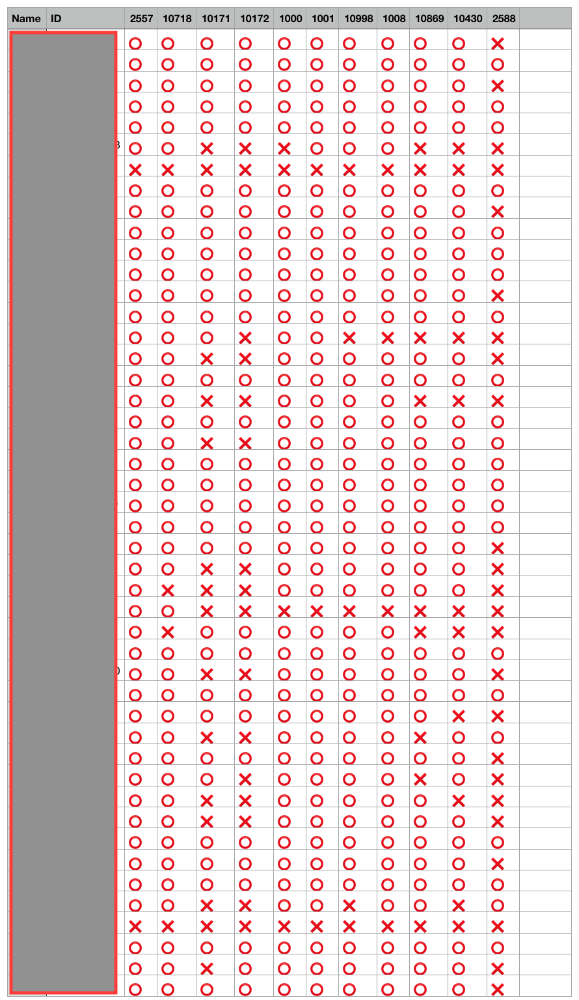

# Who Solved BOJ?

## Before you use this...

Before run this code, you have to install these python module

 - asyncio
 - bs4
 - requests

And you should create 'students.txt', refer 'student-example.txt'

## Result like this...

- This project permit you can check your student's BOJ homework.
- Like lower image, 'result.csv' will be print.

